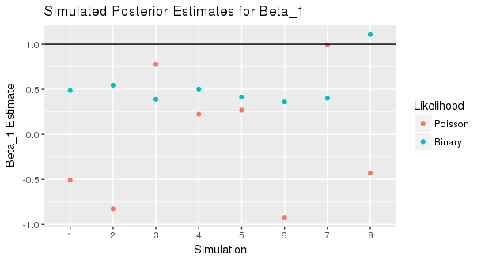
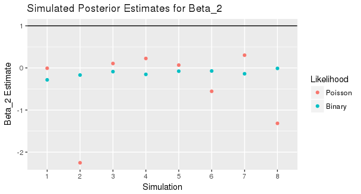
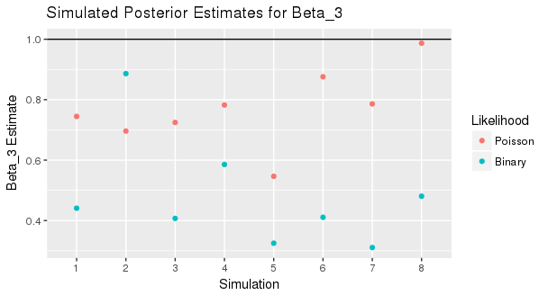
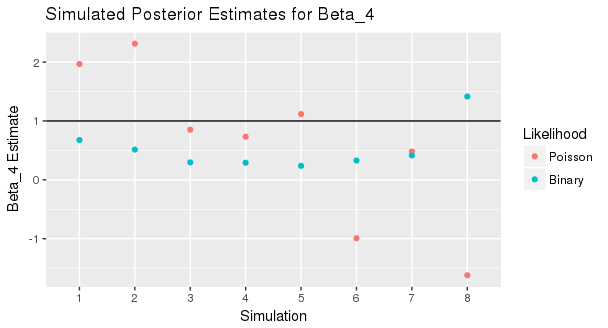

<!--
Above is the YAML (YAML Ain't Markup Language) header that includes a lot of metadata used to produce the document.  Be careful with spacing in this header!

If you'd prefer to not include a Dedication, for example, simply delete lines 17 and 18 above or add a # before them to comment them out.  If you have other LaTeX packages you would like to include, delete the # before header-includes and list the packages after hyphens on new lines.

If you'd like to include a comment that won't be produced in your resulting file enclose it in a block like this.
-->

<!--
If you receive a duplicate label error after knitting, make sure to delete the index.Rmd file and then knit again.
-->

```{r include_packages, include = FALSE}
# This chunk ensures that the thesisdowndss package is
# installed and loaded. This thesisdowndss package includes
# the template files for the thesis.
if(!require(devtools))
  install.packages("devtools", repos = "http://cran.rstudio.com")
if(!require(thesisdowndss))
  devtools::install_github("mine-cetinkaya-rundel/thesisdowndss")
library(thesisdowndss)
```

<!-- You'll need to include the order that you'd like Rmd files to appear in the _bookdown.yml file for
PDF files and also delete the # before rmd_files: there.  You'll want to not include 00(two-hyphens)prelim.Rmd
and 00-abstract.Rmd since they are handled in the YAML above differently for the PDF version.
-->

<!-- The {.unnumbered} option here means that the introduction will be "Chapter 0." You can also use {-} for no numbers
on chapters.
-->

# Introduction {.unnumbered}

The focus of this thesis is on network inference and its various approaches in a Bayesian setting. The first part of the work includes a literature review of Hoff's and Volfovsky's 2013 paper "Likelihoods for fixed rank nomination networks." The paper deals with network inference on ranked data and how different approaches to modeling network relationships perform in terms of capturing network features. The second part includes rederiving the full conditionals for the Gibbs sampler coducted in the paper. The fourth part includes a replication of a Gibbs sampler from another paper from Hoff published in 2003 called "Bilinear Mixed Effects Model for Dyadic Data", in which a slightly different approach is introduced to modeling network data. Finally a simulation study is performed that compares the performance of the two models with equivalent data. While the two paper replications are not novel research, as far as I or my professor know the direct comparison between the two models is novel research. 

<!--chapter:end:index.Rmd-->

#Review of Hoff et al. 2013

The purpose of this paper was to compare methods in handling restricted networks when conducting inference, particularly how different methods censor important features of the network. Say we have an $n$x$n$ matrix of rankings $Y$, where $Y_{i,j}$ indicates a ranking of actor $j$ by actor $i$. In the context of this paper, these rankings are friendship rankings, where actors are asked to rank other actors. These rankings need not be symmetrical, in that actor $i$ can rate actor $j$ differently than vice versa. Therefore, $Y$ represents a directed network of edges in our network. Say that in addition to this network of rankings we have data on specific actors (row/column covariates) as well as data on pairs of actors (dyadic covariates). We wish to use the available data on these actors and our observed network to infer how certain variables lead to certain rankings. Specifically, can we use actor specific or pairwise specific information to predict how actors will rank one another? This is can be modeled with regression on each entry in $Y$, where 

$y_{i,j}=\beta x_{i,j}+a_i+b_j+\epsilon{i,j}$

However, say that instead of receiving all the rankings in $Y$, we only receive some finite amount of them. In the case of the friendship rankings, imagine a certain actor could only rate $m$ friends at most. This would mean our data would be potentially censored. If an actor doesn't rank $m$ people for some reason, then we know his or her rankings are not censored. In other words, we know those who weren't ranked by him or her were not his or her friends. On the other hand, if the actor did in fact rank $m$ people, then we can't tell if an unranked person is indeed not a friend of the actor or is a friend who couldn't be ranked due to the restriction.

With a knowledge of the limitation, i.e. the number of maximum rankings by an actor $m$, we can infer from this data what the true network of rankings, which we call $Z$, potentially looks like.

1) If we observe a positive ranking, then that person is ranked.
2) If person 1's ranking is higher than person 2's ranking, then person 1 is ranked higher than person 2.
3) If we observe no ranking in AND the person in that row did not rank the maximum number of people, then that person is not ranked.

We can use this to sample from the latent matrix $Z$ using an "FRN likelihood" in Gibbs sampler as described by the paper.

Alternatively, we can simply use a "Binary likelihood" where rather than taking into account the ranks we only observe whether a rank "exists" or not. In other words, we only look for the absense or prescence of a friendship in the network, hence the binary nature.

The paper uses both a simulation study and a data analysis example with child friendships networks from Head Start programs to compare these two likelihoods in their estimates of parameters. The paper found that the binary likelihood effectively censored valuable information in the ranks and led to less accurate analysis of the network.

In order to replicate the research I first needed to derive the posterior distributions used in the Gibbs sampler, which I do the next part.

<!--chapter:end:FRN-Review.Rmd-->

# Full Conditional Derivations {#deriv}

The following derivations are for the conditionals used in Hoff et al. 2013. The conditionals are derived using general priors in order to allow different priors to be used in code implementation.

##Conditional Distribution for $\beta$
$y_{i,j}=\beta^Tx_{i,j}+a_i+b_j+\epsilon_{i,j}$

$y_{i,j}-a_i-b_j=\beta^Tx_{i,j}+\epsilon_{i,j}$

Let $\lambda_{i,j}=y_{i,j}-a_i-b_j$

$(\lambda_{i,j}, \lambda_{j,i})|\beta,X \sim N\big(\beta^T(x_{i,j},x_{j,i}),\Sigma_\epsilon \big)$

where we assume $\Sigma_\epsilon$ is known. We cancel out the correlation of each pair $(\lambda_{i,j},\lambda_{j,i})=\lambda^{(i,j)}$

$\lambda=\theta+\Sigma_\epsilon^{1/2}Z$

$\Sigma_\epsilon^{-1/2}\lambda=\Sigma_\epsilon^{-1/2}\theta+\Sigma_\epsilon^{-1/2} \Sigma_\epsilon^{1/2}Z$

$\Sigma_\epsilon^{-1/2}\lambda=\Sigma_\epsilon^{-1/2}\theta+Z$

So now the distribution for each pair $(i,j)$

$\Sigma_\epsilon^{-1/2}\lambda^{(i,j)}|\beta \sim N\big(\Sigma_\epsilon^{-1/2}(x_{i,j},x_{j,i})\beta,I\big)$

where $I$ here is the 2x2 identity matrix.

Let $(\widetilde{x}_{i,j},\widetilde{x}_{j,i})=\Sigma_\epsilon^{-1/2}(x_{i,j},x_{j,i})$

and $\widetilde{\lambda}=\Sigma_\epsilon^{-1/2}(\lambda_{i,j},\lambda_{j,i})$

The distribution for $\widetilde{\lambda}$ given $\beta$ and $\widetilde{X}$ is then

$\widetilde{\lambda} \sim MVN(\widetilde{X}\beta,I)$

We let the prior for $\beta$ be a general multivariate normal prior.

$\beta \sim MVN(\beta_0, \Sigma_0)$

Combining the two gives us the full conditional for $\beta$.

$\beta|\widetilde{\lambda} \sim MVN\big((\Sigma_0^{-1}+\widetilde{X}^T\widetilde{X})^{-1}(\Sigma_0^{-1}\beta_0+\widetilde{X}^T\widetilde{\lambda}), (\Sigma_0^{-1}+\widetilde{X}^T\widetilde{X})^{-1}\big)$

##Full conditional for $a$

$y_{i,j}=\beta^Tx_{i,j}+a_i+b_j+\epsilon_{i,j}$

$y_{i,j}-\beta^Tx_{i,j}-b_j=a_i+\epsilon_{i,j}$

Let $\widetilde{y}_{i,j}=y_{i,j}-\beta^Tx_{i,j}+b_j$. For a given cell $(i,j)$, we observe that

$\widetilde{y}_{i,j} \sim N(a_i,1)$

Assuming $\epsilon_{i,j}$ and $\epsilon_{i,k}$ are uncorrelated for all $j,k$. Let $\widetilde{y}_j^{a_i}$ be $\widetilde{y}_{i,j}$ for a given $a_i$. Then we can write

$\widetilde{y}_1^{a_i}, \widetilde{y}_2^{a_i},...,\widetilde{y}_{n-1}^{a_i} \sim N(a_i,1)$

Where these are independent and identically distributed.

For the prior, we must take into account the dependence between each $a_i$ and $b_i$. The joint probability is defined to be

$(a_i,b_i)\sim N(0,\Sigma_{ab})$

Where $\Sigma_{ab}$ is some known covariance matrix. The distribution of $a_i$ conditional on $b_i$ is also a normal distribution.

$a_i|b_i \sim N(\mu_0,\sigma_0^2)$, where

$\mu_0=\dfrac{\rho \sigma_a b_i}{\sigma_b}$

$\sigma_0^2=\sigma_a^2(1-\rho^2)$

Here $\sigma_a$ and $\sigma_b$ are the standard deviations of $a_i$ and $b_i$, respectively, and $\rho$ is the correlation between $a_i$ and $b_i$.

Combining information from the data and the prior, we can find the posterior distribution of $a_i$ for a given row $i$. This clearly turns out to be a normal-normal model, where the posterior distribution for $a_i$ is 

$a_i|\widetilde{y}_1^{a_i},\widetilde{y}_2^{a_i},...,\widetilde{y}_{n-1}^{a_i} \sim N(\mu, \sigma^2)$

where

$\mu=\dfrac{\frac{\mu_0}{\sigma_0^2}+(n-1)\bar{\widetilde{y}}^{a_i}}{\frac{1}{\sigma_0^2}+n-1}$

$\sigma^2=\dfrac{1}{\frac{1}{\sigma_0^2}+n-1}$

Since the conditional distribution for each $a_i$ is a normal distribution, we can sample from the vector $a$ using just a multivariate normal distribution.

##Full conditional for $b$
The full conditional for $b$ will look similar to $a$. We now define $\widetilde{y}_{i,j}$ to be

$y_{i,j}-\beta^Tx_{i,j}-a_i$

and each $\widetilde{y}_{i,j}$ is distributed normally

$\widetilde{y}_1^{b_i}, \widetilde{y}_2^{b_i},...,\widetilde{y}_{n-1}^{b_i} \sim N(b_i,1)$

Where these are independent and identically distributed.

Likewise, the prior for $b_i$ conditional on $a_i$ is similar to that for $a_i$. 

$b_i|a_i \sim N(\mu_0,\sigma_0^2)$, where 

$\mu_0=\dfrac{\rho \sigma_b a_i}{\sigma_a}$

$\sigma_0^2=\sigma_b^2(1-\rho^2)$

Combining the information from the prior and the likelihood, we find the full conditional of $b_i$ for a given $i$ is normally distributed with parameters

$b_i|\widetilde{y}_1^{b_i},\widetilde{y}_2^{b_i},...,\widetilde{y}_{n-1}^{b_i} \sim N(\mu, \sigma^2)$

where

$\mu=\dfrac{\frac{\mu_0}{\sigma_0^2}+(n-1)\bar{\widetilde{y}}^{b_i}}{\frac{1}{\sigma_0^2}+n-1}$

$\sigma^2=\dfrac{1}{\frac{1}{\sigma_0^2}+n-1}$

Again, because the conditional distribution for each $b_i$ is normal, we can sample the vector $b$ using a multivariate normal distribution.

##Full conditional for $Y$

$p(Y|\beta,a,b,S)\propto p(Y|\beta,a,b)p(Y|S)$

$y_{i,j}|\beta,a_i,b_j \sim N(\beta^Tx_{i,j}+a_i+b_j,1)$

###Case 1: $s_{i,j}>0$

$y_{i,j}$ is constrained to the interval $(a,b)$, where

$a=max(y_{i,k}:s_{i,k}<s_{i,j})$

$b=min(y_{i,k}:s_{i,k}>s_{i,j})$

Here both $a$ and $b$ depend on $S_i$.

The full conditional for each $y_{i,j}$ is then a constrained normal distribution on $(a,b)$.

$\dfrac{\phi(y_{i,j}-\beta^Tx_{i,j}-a_i-b_j)}{\Phi(b-\beta^Tx_{i,j}-a_i-b_j)-\Phi(a-\beta^Tx_{i,j}-a_i-b_j)}$

Where $\phi(x)$ is the standard normal pdf, and $\Phi$ is the standard normal cdf.

###Case 2: $s_{i,j}=0$ and $d_i<m$

$y_{i,j}$ is constrained to the interval $(a,b)$, where

$a=-\infty$

$b=0$

The full conditional for each $y_{i,j}$ is then a constrained normal distribution on $(a,b)$.

$\dfrac{\phi(y_{i,j}-\beta^Tx_{i,j}-a_i-b_j)}{\Phi(-\beta^Tx_{i,j}-a_i-b_j)}$

###Case 3: $s_{i,j}=0$ and $d_i=m$

$y_{i,j}$ is constrained to the interval $(a,b)$, where

$a=-\infty$

$b=min(y_{i,k}:s_{i,k}>0)$

The full conditional for each $y_{i,j}$ is then a constrained normal distribution on $(a,b)$.

$\dfrac{\phi(y_{i,j}-\beta^Tx_{i,j}-a_i-b_j)}{\Phi(b-\beta^Tx_{i,j}-a_i-b_j)}$


<!--chapter:end:Full-Conditional-Derivations.Rmd-->


# Mixed Effects Model with Poisson Likelihood {#pois-rep}

In the previous section, the observed data $Y$ was a matrix of directed rankings of nodes, where $Y_{i,j}$ denoted the ranking of $j$ by $i$. The analysis performed took into count their relative sizes. In other words, given that we observed actor $i$ ranking actor $j$ higher than actor $k$, our inferred relationship would retain this ranking. However, what if instead treated these rankings as count data? In other words, say our matrix $Y$ represented a weighted, directed graph of emails, where $Y_{i,j}$ denoted the number of emails actor $i$ sent to actor $j$. This new treatment of the data would purely focus on the magnitudes of the relationships between the actors, and not their relative rankings.

## Poisson model with log-link

We can model the number of emails sent from actor $i$ to actor $j$ as a Poisson distributed variable with mean $e^{\theta_{i,j}}$. Hoff's paper defines a log-link function to relate the regression model to the Poisson nature of the data. We first perform linear regression on $\theta_{i,j}$, where

$\theta_{i,j}=\beta_{d1}x_{i,j,1}+\beta_{d2}x_{i,j,2}+a_i+b_j+\epsilon_{i,j}$

$Y_{i,j}\sim Pois(e^{\theta_{i,j}})$

For the code replication we temporarily assume there is no correlation between entries in $Y$. Therefore, $\epsilon_{i,j}=0$. This assumption is likely not true with real data, as we almost always expect to observe some sort of correlation between relationships.

With the use of the log-link, our posterior estimate for $\theta$ is not conjugate. Therefore, we must perform a Metropolis Hastings step to accept/reject proposed values of $\theta$. The step used in Hoff's paper is described below. Note how the proposal distribution is symmetric, which means this is simply a Metropolis step.

Proposal distribution for $\theta_{i,j}$: $\theta^*_{i,j} \sim N(\beta_{d1}x_{i,j,1}+\beta_{d2}x_{i,j,2}+a_i+b_j, 1)$ $\forall i\neq j$

Accept $\theta_{i,j}$ with probability $\dfrac{p(y_{i,j}|\theta^*_{i,j})p(\theta^*_{i,j}|y_{i,j})}{p(y_{i,j}|\theta_{i,j})p(\theta_{i,j}|y_{i,j})}$

## Gibbs Sampler
The process of the Gibbs sampler conducted in Hoff's paper is outlined below. Note how similar it is to the Gibbs sampler under the FRN likelihood. The only change to the process is the calculation of the likelihood. All other parameter estimations remain the same.

1. Sample $\beta_1,\beta_2$ from full conditional.
2. Sample $a,b$ from full conditional.
3. for each $i\neq j$
    - propose $\theta_{i,j}$ and accept/reject

## Code replication
The code for the Gibbs sampler was replicated from scratch with a simulated dataset $Y$ and a simulated covariance matrix $X$. The observed data were generated as follows.

$y_{i,j} \sim Pois(4)$ $\forall i\neq j$

$x_{i,j,1}=1$ $\forall i\neq j$

$x_{i,j,2}=1$ $\forall i\leq \frac{n}{2}$

$x_{i,j,2}=1$ $\forall i> \frac{n}{2}$

The first dyadic coefficient acts as an intercept to the model, hence the lack of a need for a separate coefficient for the intercept in our regression model. The second dyadic coefficient acts as a kind of group membership variable, where the first 50 rows are part of the first group ($X_{i,j,2}=1$) and the last 50 rows are part of the second group ($X_{i,j,2}=0$).

In order to test for the accuracy of the replicated results, the posterior parameter estimates were compared to results from the "AMEN" package, an R package created by Hoff and Volfovsky to run mixed effects models on network data using Gibbs samplers. Below are the results of the replicated code and the "AMEN" package's $ame()$ function when given the same model and data.

```{r,echo=FALSE, eval=TRUE, include=FALSE}
library(MASS)
library(MCMCpack)
library(amen)
```

```{r,echo=FALSE, eval=TRUE}
#Specify example dataset
n=100
p=2
m=n-50
Z<-matrix(nrow=n,ncol=n)
Y<-matrix(nrow=n,ncol=n)
diag(Y)<--1
for(i in seq(1,n,1)){
  for(j in seq(1,n,1)){
    if(i!=j){
      Y[i,j]<-rpois(n=1,lambda=4)
    }
  }
}
X<-array(dim=c(n,n,p))
X[,,1]<-matrix(1,nrow=n,ncol=n)
diag(X[,,1])<--1
A<-matrix(1,nrow=n/2,ncol=n/2)
B<-matrix(0,nrow=n/2,ncol=n/2)
X[,,2]<-rbind(A,B)
diag(X[,,2])<--1
#Specify prior parameters
beta_0<-rep(0,p)
Sigma_0<-matrix(nrow=p,ncol=p)
Sigma_0[1,]<-c(2,1)
Sigma_0[2,]<-c(1,2)
v_0<-4
S_0<-matrix(nrow=2,ncol=2)
S_0[1,]<-c(2,1)
S_0[2,]<-c(1,2)
I2<-matrix(0,nrow=n-1,ncol=n-1)
diag(I2)<-1/6

#Set starting values
beta<-mvrnorm(n=1,mu=beta_0,Sigma=Sigma_0)
Sigma_ab<-riwish(v_0,solve(S_0))
a<-c()
b<-c()
for(i in seq(1,n,1)){
  ab<-mvrnorm(n=1,mu=c(0,0),Sigma=Sigma_ab)
  a<-c(a,ab[1])
  b<-c(b,ab[2])
}
Theta<-matrix(0,nrow=n,ncol=n)
diag(Theta)<--1
for(i in seq(1,n,1)){
  for(j in seq(1,n,1)){
    if(i!=j){
      Theta[i,j]<-beta%*%X[i,j,]+a[i]+b[j]
    }
  }
}
#Create matrices to store values
s=1000
betas<-matrix(nrow=s,ncol=p)
rs<-c()
```

```{r,echo=FALSE, eval=TRUE}
#Start Gibbs Sampler
for(k in seq(1,s,1)){

#Sample Sigma_ab from posterior
  Sigma_ab<-riwish(v_0+n,solve(S_0)+t(cbind(a,b))%*%cbind(a,b))
  sigma_a<-sqrt(Sigma_ab[1,1])
  sigma_b<-sqrt(Sigma_ab[2,2])
    
#Sample a from posterior
  mu<-c()
  for(i in seq(1,n,1)){
    Theta2<-c()
    for(j in seq(1,n,1)){
      if(i!=j){
      Theta2<-c(Theta2,Theta[i,j]-t(beta)%*%X[i,j,]-b[j])
      }
    }
    mu<-c(mu,(sum(Theta2[-i])/(1/sigma_a^2+n-1)))
  }
    temp<-matrix(0,nrow=n,ncol=n)
    diag(temp)<-solve(1/sigma_a^2+n-1)
    a<-mvrnorm(n=1,mu=mu,Sigma=temp)
  
#Sample b from posterior
  mu<-c()
  for(i in seq(1,n,1)){
    Theta2<-c()
    for(j in seq(1,n,1)){
      if(i!=j){
      Theta2<-c(Theta2,Theta[j,i]-t(beta)%*%X[j,i,]-a[i])
      }
    }
    mu<-c(mu,(sum(Theta2[-j])/(1/sigma_b^2+n-1)))
  }
    temp<-matrix(0,nrow=n,ncol=n)
    diag(temp)<-solve(1/sigma_b^2+n-1)
    a<-mvrnorm(n=1,mu=mu,Sigma=temp)
  
  
#Sample beta from full conditional
  F1<-matrix(nrow=n^2-n,ncol=1)
  F1[,1]<-Theta[Theta!=-1]
  G<-matrix(nrow=n^2-n,ncol=2)
  H<-X[,,1]
  G[,1]<-H[H!=-1]
  H<-X[,,2]
  G[,2]<-H[H!=-1]
  beta_mu<-solve(solve(Sigma_0)+t(G)%*%G)%*%(solve(Sigma_0)%*%beta_0+t(G)%*%F1)
  beta_Sigma<-solve(solve(Sigma_0)+t(G)%*%G)
  
  beta<-mvrnorm(n=1,mu=beta_mu,Sigma=beta_Sigma)
  
  #Propose Thetas
  for(i in seq(1,n,1)){
    Xi<-X[i,,]
    Xi<-Xi[-i,]
    Yi<-Y[i,]
    Yi<-Yi[-i]
    Thetai<-Theta[i,]
    Thetai<-Thetai[-i]
        Tprop<-mvrnorm(n=1,mu=Xi%*%beta+a[i]+b[-i],Sigma=I2)
        logr<-sum(dpois(Yi,exp(Tprop),log=T))-
          sum(dpois(Yi,exp(Thetai),log=T))+
          sum(dnorm(Tprop,mean=Xi%*%beta+a[i]+b[-i],sd=sqrt(1/6),log=T))-
          sum(dnorm(Thetai,mean=Xi%*%beta+a[i]+b[-i],sd=sqrt(1/6),log=T))
        if(log(runif(1))<logr){
          Tprop<-append(Tprop,-1,after=i-1)
          Theta[i,]<-Tprop
          rs<-c(rs,1)
        }else{
          rs<-c(rs,0)
        }
  }
  
#Store beta
  betas[k,]<-beta
}
```

```{r,echo=FALSE, eval=TRUE}
print("Acceptance Rate")
print(mean(rs))
print("Posterior estimate for beta")
for(i in seq(1,p,1)){
  print(mean(betas[,i]))
}
print("Plots")
A<-seq(1,s,1)
plot(A,betas[,1],type="l", xlab="Iteration",ylab="Beta_1",main="Posterior Estimates from Gibbs Sampler for Beta_1")
plot(A,betas[,2],type="l", xlab="Iteration",ylab="Beta_2",main="Posterior Estimates from Gibbs Sampler for Beta_2")
acf(betas[,1],type="correlation",main="ACF for Beta_1")
acf(betas[,2],type="correlation",main="ACF for Beta_2")
```


<!--chapter:end:Thesis-Replication-Code-v7.Rmd-->

```{r include_packages_2, include = FALSE}
if(!require(devtools))
  install.packages("devtools", repos = "http://cran.rstudio.com")
if(!require(dplyr))
    install.packages("dplyr", repos = "http://cran.rstudio.com")
if(!require(ggplot2))
    install.packages("ggplot2", repos = "http://cran.rstudio.com")
if(!require(ggplot2))
    install.packages("bookdown", repos = "http://cran.rstudio.com")
if(!require(thesisdowndss)){
  library(devtools)
  devtools::install_github("mine-cetinkaya-rundel/thesisdowndss")
  }
library(thesisdowndss)
```

# Simulation Study {#sim-study}

Now that we've been able to replicate the code for simulating with a fixed-rank likelihood approach as well as the code for simulating with a poisson likelihood approach, we can compare the two methods in their accuracy of estimating row, column and dyadic coefficients. To do this we conducted a simulation study. We first established the true parameters to be some specific values to judge our estimates by. For each simulation, we generated data from the true model and estimated the posterior coefficients using the two approaches. By using the same generated data for each approach we can directly compare their ability to capute the row, column, and dyadic effects of the model. First we generated count data $Y$ to use for the Poisson likelihood approach. Then we "binarized" this data to create the data frame $Y^b$ where

$Y^b_{i,j}=1$ if $Y_{i,j}>0$

$Y^b_{i,j}=0$ if $Y_{i,j}\leq0$

and used this data frame for our estimation using the binary likelihood approach.

Our generation of the data comes from the approach used in section 3.2 from Hoff et. al 2013.

##True Parameters

Our model for $Y$ is

$Y_{i,j}=\beta_{d1}X_{i,j,1}+\beta_{d2}X_{i,j,2}+\beta_{r}X_{i,r}+\beta_{c}X_{j,c}+a_i+b_j+\epsilon_{i,j}$

For our simulation we generate two dyadic covariates in addition to a row and column-specific covariate. Note that for this simulation we also had zero correlation between entries in $Y$, so $\epsilon_{i,j}=0$ for all $i$, $j$. This assumption likely can't be made in the context of real data, as some form of correlation almost always exists between entries in $Y$.

Our true values for the coefficients are given below.

$\beta_{d1}=\beta_{d2}=\beta_r=\beta_c=1$

$\Sigma_{ab}= \begin{bmatrix} 1 & 0.5 \\ 0.5 & 1 \end{bmatrix}$


##Generating Data

Our generated data comes from sampling from standard normal distributions. Here we have a matrix of n=100 actors/nodes.

$x_{1,r},x_{2,r},...,x_{n,r} \sim$ i.i.d. $N(0,1)$

$x_{1,c},x_{2,c},...,x_{n,c} \sim$ i.i.d. $N(0,1)$

$x_{i,j,1} \sim$ i.d.d. $N(0,1)$ $\forall i!=j$

$x_{i,j,2}=\dfrac{z_iz_j}{0.42}$, where $z_1,z_2,...,z_n \sim$ i.i.d. $Bern(0.5)$

Note here the slightly different method for generating the second dyad covariate. Here the second dyad is meant to simulate a kind of group membership.

##Results
Eight simulations were conducted in total. The Gibbs samplers for both the Poisson Likelihood approach and the Binary Likelihood approach were run for 10,000 simulations each. The posterior estimates for each \Beta are plotted in the figures below.

```{r fig1, results="asis", echo=FALSE, fig.cap="Figure 1: Posterior Estimates for Beta_1", out.extra="scale=0.75"}

```

```{r fig2, results="asis", echo=FALSE, fig.cap="Figure 1: Posterior Estimates for Beta_2", out.extra="scale=0.75"}

```

```{r fig3, results="asis", echo=FALSE, fig.cap="Figure 1: Posterior Estimates for Beta_3", out.extra="scale=0.75"}

```

```{r fig4, results="asis", echo=FALSE, fig.cap="Figure 1: Posterior Estimates for Beta_4", out.extra="scale=0.75"}

```


```{r setup, include=FALSE, eval=FALSE}
knitr::opts_chunk$set(echo = TRUE)
library(MASS)
library(MCMCpack)
library(truncnorm)
library(ggplot2)
```

```{r echo=FALSE, eval=FALSE}
#True parameters
Beta_row_true=Beta_col=Beta_dyad1=Beta_dyad2=1
Sigma_ab_true=matrix(c(1,.5,.5,1),nrow=2,ncol=2)
#Sigma_e_true=matrix(c(1,.9,.9,1),nrow=2,ncol=2)
s<-100
num_sim<-3
Store<-data.frame(Est=1,Beta=-1,Type=factor("Poisson",level=c("Poisson","Binary")),Sim=4)
```


```{r echo=FALSE, eval=FALSE}
for(q in seq(1,num_sim,1)){
#Simulate X
n=100
p=4
X<-array(dim=c(n,n,p))
X_row<-rnorm(n=n,mean=0,sd=1)
X_col<-rnorm(n=n,mean=0,sd=1)
for(i in seq(1,n,1)){
  X[i,-i,3]<-rep(X_row[i],n-1)
  X[-i,i,4]<-rep(X_col[i],n-1)
}
X[,,1]<-rnorm(n=n^2,mean=0,sd=1)
Z<-matrix(nrow=n,ncol=n)
Z[,]<-rbinom(n=n^2,size=1,prob=.5)
X[,,2]<-Z[,]/.42
diag(X[,,1])<--1
diag(X[,,2])<--1
diag(X[,,3])<--1
diag(X[,,4])<--1

ab<-mvrnorm(n=n,mu=c(0,0),Sigma=Sigma_ab_true)
Y<-matrix(nrow=n,ncol=n)
for(i in seq(1,n,1)){
  for(j in seq(1,n,1)){
    if(i!=j){
      #ep<-mvrnorm(mu=c(0,0),Sigma=Sigma_e_true)
      Y[i,j]<-rpois(1,exp(sum(X[i,j,])+ab[i,1]+ab[j,2]))
    }
  }
}
S<-matrix(0,nrow=n,ncol=n)
for(i in seq(1,n,1)){
  for(j in seq(1,n,1)){
    if(i!=j){
      if(Y[i,j]>0){
        S[i,j]<-1
      }
    }
  }
}
diag(S)<--1
#Specify prior parameters
beta_0<-rep(0,p)
Sigma_0<-matrix(nrow=p,ncol=p)
Sigma_0[1,]<-c(2,1,1,1)
Sigma_0[2,]<-c(1,2,1,1)
Sigma_0[3,]<-c(1,1,2,1)
Sigma_0[4,]<-c(1,1,1,2)
v_0<-4
S_0<-matrix(nrow=2,ncol=2)
S_0[1,]<-c(2,1)
S_0[2,]<-c(1,2)
I2<-matrix(0,nrow=n-1,ncol=n-1)
diag(I2)<-1/6

#Set starting values
beta<-mvrnorm(n=1,mu=beta_0,Sigma=Sigma_0)
Sigma_ab<-riwish(v_0,solve(S_0))
a<-c()
b<-c()
for(i in seq(1,n,1)){
  ab<-mvrnorm(n=1,mu=c(0,0),Sigma=Sigma_ab)
  a<-c(a,ab[1])
  b<-c(b,ab[2])
}
Theta<-matrix(0,nrow=n,ncol=n)
diag(Theta)<--1
for(i in seq(1,n,1)){
  for(j in seq(1,n,1)){
    if(i!=j){
      Theta[i,j]<-beta%*%X[i,j,]+a[i]+b[j]
    }
  }
}
betas_poisson<-matrix(nrow=s,ncol=p)
rs_poisson<-c()

#Start Gibbs Sampler for Count Data
for(k in seq(1,s,1)){

#Sample Sigma_ab from posterior
  Sigma_ab<-riwish(v_0+n,solve(S_0)+t(cbind(a,b))%*%cbind(a,b))
  sigma_a<-sqrt(Sigma_ab[1,1])
  sigma_b<-sqrt(Sigma_ab[2,2])
    
#Sample a from posterior
  mu<-c()
  for(i in seq(1,n,1)){
    Theta2<-c()
    for(j in seq(1,n,1)){
      if(i!=j){
      Theta2<-c(Theta2,Theta[i,j]-t(beta)%*%X[i,j,]-b[j])
      }
    }
    mu<-c(mu,(sum(Theta2[-i])/(1/sigma_a^2+n-1)))
  }
    temp<-matrix(0,nrow=n,ncol=n)
    diag(temp)<-solve(1/sigma_a^2+n-1)
    a<-mvrnorm(n=1,mu=mu,Sigma=temp)
  
#Sample b from posterior
  mu<-c()
  for(i in seq(1,n,1)){
    Theta2<-c()
    for(j in seq(1,n,1)){
      if(i!=j){
      Theta2<-c(Theta2,Theta[j,i]-t(beta)%*%X[j,i,]-a[i])
      }
    }
    mu<-c(mu,(sum(Theta2[-j])/(1/sigma_b^2+n-1)))
  }
    temp<-matrix(0,nrow=n,ncol=n)
    diag(temp)<-solve(1/sigma_b^2+n-1)
    a<-mvrnorm(n=1,mu=mu,Sigma=temp)
  
  
#Sample beta from full conditional
  F1<-matrix(nrow=n^2-n,ncol=1)
  F1[,1]<-Theta[Theta!=-1]
  G<-matrix(nrow=n^2-n,ncol=4)
  H<-X[,,1]
  G[,1]<-H[H!=-1]
  H<-X[,,2]
  G[,2]<-H[H!=-1]
  H<-X[,,3]
  G[,3]<-H[H!=-1]
  H<-X[,,4]
  G[,4]<-H[H!=-1]
  beta_mu<-solve(solve(Sigma_0)+t(G)%*%G)%*%(solve(Sigma_0)%*%beta_0+t(G)%*%F1)
  beta_Sigma<-solve(solve(Sigma_0)+t(G)%*%G)
  
  beta<-mvrnorm(n=1,mu=beta_mu,Sigma=beta_Sigma)
  
  #Propose Thetas
  for(i in seq(1,n,1)){
    Xi<-X[i,,]
    Xi<-Xi[-i,]
    Yi<-Y[i,]
    Yi<-Yi[-i]
    Thetai<-Theta[i,]
    Thetai<-Thetai[-i]
        Tprop<-mvrnorm(n=1,mu=Xi%*%beta+a[i]+b[-i],Sigma=I2)
        logr<-sum(dpois(Yi,exp(Tprop),log=T))-
          sum(dpois(Yi,exp(Thetai),log=T))+
          sum(dnorm(Tprop,mean=Xi%*%beta+a[i]+b[-i],sd=sqrt(1/6),log=T))-
          sum(dnorm(Thetai,mean=Xi%*%beta+a[i]+b[-i],sd=sqrt(1/6),log=T))
        if(log(runif(1))<logr){
          Tprop<-append(Tprop,-1,after=i-1)
          Theta[i,]<-Tprop
          rs_poisson<-c(rs_poisson,1)
        }else{
          rs_poisson<-c(rs_poisson,0)
        }
  }
  
#Store beta
  betas_poisson[k,]<-beta
}

#Specify prior parameters
beta_0<-rep(0,p)
Sigma_0<-matrix(nrow=p,ncol=p)
Sigma_0[1,]<-c(2,1,1,1)
Sigma_0[2,]<-c(1,2,1,1)
Sigma_0[3,]<-c(1,1,2,1)
Sigma_0[4,]<-c(1,1,1,2)
v_0<-4
S_0<-matrix(nrow=2,ncol=2)
S_0[1,]<-c(2,1)
S_0[2,]<-c(1,2)
I2<-matrix(0,nrow=n-1,ncol=n-1)
diag(I2)<-1/6

#Set starting values
beta<-mvrnorm(n=1,mu=beta_0,Sigma=Sigma_0)
Sigma_ab<-riwish(v_0,solve(S_0))
a<-c()
b<-c()
for(i in seq(1,n,1)){
  ab<-mvrnorm(n=1,mu=c(0,0),Sigma=Sigma_ab)
  a<-c(a,ab[1])
  b<-c(b,ab[2])
}
betas_binary<-matrix(nrow=s,ncol=p)
rs_binary<-c()
Z<-S

#Start Gibbs Sampler for Count Data
for(k in seq(1,s,1)){

#Sample Sigma_ab from posterior
  Sigma_ab<-riwish(v_0+n,solve(S_0)+t(cbind(a,b))%*%cbind(a,b))
  sigma_a<-sqrt(Sigma_ab[1,1])
  sigma_b<-sqrt(Sigma_ab[2,2])
    
#Sample a from posterior
  mu<-c()
  for(i in seq(1,n,1)){
    Z2<-c()
    for(j in seq(1,n,1)){
      if(i!=j){
      Z2<-c(Z2,Z[i,j]-t(beta)%*%X[i,j,]-b[j])
      }
    }
    mu<-c(mu,(sum(Z2[-i])/(1/sigma_a^2+n-1)))
  }
    temp<-matrix(0,nrow=n,ncol=n)
    diag(temp)<-solve(1/sigma_a^2+n-1)
    a<-mvrnorm(n=1,mu=mu,Sigma=temp)
  
#Sample b from posterior
  mu<-c()
  for(i in seq(1,n,1)){
    Z2<-c()
    for(j in seq(1,n,1)){
      if(i!=j){
      Z2<-c(Z2,Z[j,i]-t(beta)%*%X[j,i,]-a[i])
      }
    }
    mu<-c(mu,(sum(Z2[-j])/(1/sigma_b^2+n-1)))
  }
    temp<-matrix(0,nrow=n,ncol=n)
    diag(temp)<-solve(1/sigma_b^2+n-1)
    a<-mvrnorm(n=1,mu=mu,Sigma=temp)
  
  
#Sample beta from full conditional
  F1<-matrix(nrow=n^2-n,ncol=1)
  F1[,1]<-Z[Z!=-1]
  G<-matrix(nrow=n^2-n,ncol=4)
  H<-X[,,1]
  G[,1]<-H[H!=-1]
  H<-X[,,2]
  G[,2]<-H[H!=-1]
  H<-X[,,3]
  G[,3]<-H[H!=-1]
  H<-X[,,4]
  G[,4]<-H[H!=-1]
  beta_mu<-solve(solve(Sigma_0)+t(G)%*%G)%*%(solve(Sigma_0)%*%beta_0+t(G)%*%F1)
  beta_Sigma<-solve(solve(Sigma_0)+t(G)%*%G)
  
  beta<-mvrnorm(n=1,mu=beta_mu,Sigma=beta_Sigma)
  
  for(i in seq(1,n,1)){
    for(j in seq(1,n,1)){
      if(i!=j){
        if(S[i,j]>0){
          Z[i,j]<-rtruncnorm(n=1,a=0,b=Inf,mean=X[i,j,]%*%beta+a[i]+b[j],sd=1)
        }else{
          Z[i,j]<-rtruncnorm(n=1,a=-Inf,b=0,mean=X[i,j,]%*%beta+a[i]+b[j],sd=1)
        }
      }
    }
  }
#Store beta
betas_binary[k,]<-beta
}

for(w in seq(1,p,1)){
  Store<-rbind(Store,c(mean(betas_poisson[,w]),w,"Poisson",q))
  Store<-rbind(Store,c(mean(betas_binary[,w]),w,"Binary",q))
}
}
```

```{r echo=FALSE, eval=FALSE}
ggplot(data=Store[Store$Beta==1,], aes(x=Sim, y=as.numeric(Est), group=Type, color=Type)) +
    geom_line() +
    geom_point() + geom_hline(yintercept = 1) + labs(colour = "Likelihood", x="Simulation", y="Beta_1 Estimate", title="Simulated Posterior Estimates for Beta_1")

ggplot(data=Store[Store$Beta==2,], aes(x=Sim, y=as.numeric(Est), group=Type, color=Type)) +
    geom_line() +
    geom_point() + geom_hline(yintercept = 1) + labs(colour = "Likelihood", x="Simulation", y="Beta_2 Estimate", title="Simulated Posterior Estimates for Beta_2")

ggplot(data=Store[Store$Beta==3,], aes(x=Sim, y=as.numeric(Est), group=Type, color=Type)) +
    geom_line() +
    geom_point() + geom_hline(yintercept = 1) + labs(colour = "Likelihood", x="Simulation", y="Beta_3 Estimate", title="Simulated Posterior Estimates for Beta_3")

ggplot(data=Store[Store$Beta==4,], aes(x=Sim, y=as.numeric(Est), group=Type, color=Type)) +
    geom_line() +
    geom_point() + geom_hline(yintercept = 1) + labs(colour = "Likelihood", x="Simulation", y="Beta_4 Estimate", title="Simulated Posterior Estimates for Beta_4")
```


<!--chapter:end:Thesis-Simulation-Study-2.Rmd-->

